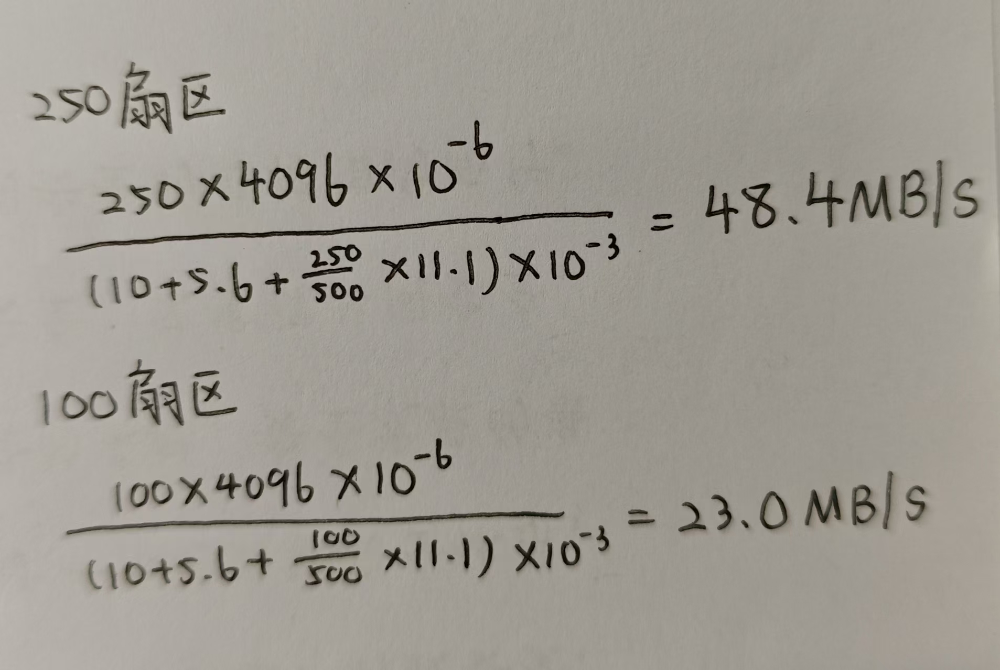
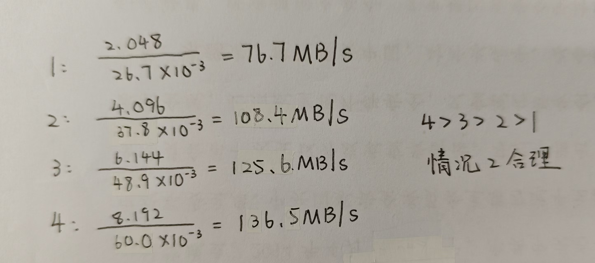

**第一题**

磁盘容量：

$$
\begin{aligned}
	磁盘容量 = 2 \times 2 \times 500\,000 \times 500 \times 4096 \div 10^9 = 4096\,\text{GB}
\end{aligned}
$$

---

**第二题**

$$
\begin{aligned}
	平均延迟 &= 10 + \frac{1}{2} \times \frac{1}{5400} \times 60 \times 1000 + \frac{1}{5400} \times \frac{1}{500} \times 60 \times 1000 \\
&= 15.6\,\text{ms}
\end{aligned}
$$

---

**第三题**

$$
\begin{aligned}
	IOPS = \frac{1}{15.6} \times 1000 = 64.1
\end{aligned}
$$

---

**第四题**

各项时间：

$$t_{寻道} = 10\,\text{ms}$$
$$t_{旋转}=\frac{1}{2} \times \frac{1}{5400} \times 60 \times 1000=5.6\,\text{ms}$$
$$t_{传送(一圈)}=\frac{1}{5400} \times 60 \times 1000=11.1\,\text{ms}$$

通过附录1中对于250扇区和100扇区数据量计算带宽的结果，我们可以知道在同一磁道内数据越多，带宽越高。因此后续的计算我们尽可能使数据存满每一个磁道。

最理想存储文件方式：文件应存储在同一柱面上，且上一磁道读取完毕后磁头不需要再进行旋转即可开始读取下一磁道（即零延迟），如果是较大的文件则再移动到相邻柱面存储。这样文件较小时只需寻道一次，节省了很多时间。

注：我也曾考虑如果磁头移至相邻磁道后也零延迟地读取下一磁道，但得到了文件越大带宽越大的无极值结果，并且经过与ds的讨论发现，现实中几乎无法做到这一点，因此放弃了这种思路。

由于跨柱面的读取会带来额外的延迟，因此带宽的计算只需在同一柱面内，我考虑了两种情况：

1. 文件足够小，同一柱面未存满，额外的旋转延迟与传送时间减少，但总数据量随之减少
2. 文件偏大，同一柱面存满，额外的旋转延迟与传送时间增加，但总数据量随之增加

这里只给出最终结果，计算过程放在附录2：
$$
总数据量=500 \times 4096 \times 4 \div 10^6 = 8.192\,\text{MB}
$$
$$
	总访问延迟 = t_{寻道} +  t_{旋转} + 4 \times t_{传送(一圈)} = 60.0\,\text{ms}
$$

$$
	顺序读取带宽 = \frac{8.192}{76.7} = 0.1365\,\text{MB/ms} = 136.5\,\text{MB/s}
$$

附录：

1. 同一磁道不同数据量求得的带宽比较  
   

2. 同一柱面不同数据量求得的带宽比较  
   