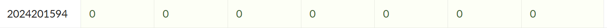

# bomblab 报告

姓名：王松宸

学号：2024201594

| 总分 | phase_1 | phase_2 | phase_3 | phase_4 | phase_5 | phase_6 | secret_phase |
| ---- | ------- | ------- | ------- | ------- | ------- | ------- | ------------ |
| 7    | 1       | 1       | 1       | 1       | 1       | 1     | 1           |


scoreboard 截图：



<!-- TODO: 用一个scoreboard的截图，本地图片，放到 imgs 文件夹下，不要用这个 github，pandoc 解析可能有问题 -->

## 解题报告

<!-- 对你拆掉的每个phase进行分析，并写出你得出答案的历程 -->

<!-- 如果能用伪代码还原题目源代码最佳（不属于先前提到的大段代码），语言描述自己的分析也可，每道题目的图片不建议超过两张 -->

### phase_1

#### 答案
```
But when anger's bottled up inside, can I resist against unspoken words or try to hide?
```
#### C语言伪代码
```c
int phase_1(const char *input) {
	const char *secret = "But when anger's bottled up inside, can I resist against unspoken words or try to hide?";
	// 要求：输入字符串与内存中的secret完全相同
	if (strcmp(input, secret) != 0) {
		explode_bomb();
		return -1;
	}
	return 0; // 通过
}
```
#### 思路
将输入的字符串与内存中的一个字符串进行比较，相同则返回0，若未返回0炸弹爆炸。因此取出内存中对应的字符串即可完成这个phase。

### phase_2
#### 答案
```
415515 527717 439252 655784
```
#### C语言伪代码
```c
int phase_2(const int a, const int b, const int c, const int d) {
	// 1) 检查是否提供了四个整数

	// 2) 将四个输入按“从顶到底”的顺序入栈
	int s[8];
	s[0] = a; // top
	s[1] = b;
	s[2] = c;
	s[3] = d; // bottom

	// 3) 两轮循环，每一轮计算两个数，结果依次压在输入四数的“下方”
	int s[4] = compute_x(1); // 415515
	int s[5] = compute_x(1); // 527717
	int s[6] = compute_x(2); // 439252
	int s[7] = compute_x(2); // 655784

	// 4) 逐个移动指针比较：若不相同则爆炸
	if (s[0] != s[4] || s[1] != s[5] || s[2] != s[6] || s[3] != s[7]) {
		explode_bomb();
		return -1;
	}
	return 0; // 通过
}
```
#### 思路
首先程序会检查你是不是输入了四个数，如果数量小于4炸弹就会爆炸。接着这四个数按从顶到底的顺序入栈用于后续的比较。然后是两轮循环，每一轮计算出两个数。这四个数按照从顶到底的顺序放到输入的四个数正下方（这里的下方是从栈的角度讲的）。接着移动指针逐个比较，数值不相同炸弹就会爆炸。因此我要做的就是取出中间计算出的这四个数的值作为输入。

### phase_3

#### 答案
```
5 -627
```
#### 转化为C语言代码
```c
int phase_3(unsigned int x1, int x2) {
	// 1) 输入必须是两个整数
	
	// 2) 限制条件：x1 <= 7（无符号）；x2 < 0（有符号）
	if (x1 > 7u || x2 >= 0) {
		explode_bomb();
		return -1;
	}

	// 3) 根据x1进行switch跳转（间接跳转）
	switch (x1) {
		case 0:
		case 1:
		case 2:
		case 3:
		case 6:
		case 7:
			explode_bomb();
			return -1;
		case 4:
			if (x2 != -627) {
				explode_bomb();
				return -1;
			}
			break;
		case 5:
			// 题面推导为要求x2 == 0（但同时要求x2 < 0故不可行）；因此该分支也爆炸
			explode_bomb();
			return -1;
		default:
			// 不会到达，因为x1>7时前面已爆炸
			explode_bomb();
			return -1;
	}

	return 0; // 通过（仅当x1==4且x2==-627）
}
```
#### 思路
首先程序会检查你是不是输入了两个整数，不是的话就会爆炸。假如这两个数按输入顺序分别为x<sub>1</sub>和x<sub>2</sub>，程序会检查它们各自的大小，无符号x<sub>1</sub>应当小于等于7，有符号x<sub>2</sub>应当小于0。满足第一步的条件后会计算出一个地址存到rax寄存器中，并跳转到这个地址执行相应的操作。这部分是一种`Switch`结构，在x<sub>1</sub>的值为0，1，2，3，6，7时都会让炸弹爆炸，在x<sub>1</sub>为4时检验x<sub>2</sub>的值是否为-627，如果x<sub>2</sub> = -627那么炸弹就不会爆炸，在x<sub>1</sub>为5时要求x<sub>2</sub>的值为0，这显然是不可能的。因此相应的输入也就很明确了。

### phase_4

#### 答案
```
31 BA
```
#### C语言伪代码
```c
int func4_1(int n){
	if(n<=0) return 0;
	if(n==1) return 1;
	return 2*func4_1(n-1)+1; // T(n)=2^n-1
}

// 递归生成两个字符
void func4_2(int n,int value,int chA,int chB,int chC,char *out){
	if(n==1){
		out[0]=(char)chA; out[1]=(char)chB; out[2]='\0';
		return;
	}
	int x = func4_1(n-1); // x = 2^{n-1}-1
	if(x < value){
		if(x + 1 == value){ // 命中边界直接输出
			out[0]=(char)chA; out[1]=(char)chB; out[2]='\0';
			return;
		}
		// 右侧区间：缩减 value 并重排 (A,B,C)->(B,C,A)
		func4_2(n-1, value - x - 1, chB, chC, chA, out);
	} else {
		// 左侧区间：保持 value 并重排 (A,B,C)->(C,A,B)
		func4_2(n-1, value, chC, chA, chB, out);
	}
}

int phase_4(const char *line){
	// 输入必须是一个整数和一个字符串（字符串保留两位）
	// 核心部分 ↓
	if(num != func4_1(5)){ explode_bomb(); return -1; } // 必须是31
	if(strlen(str) != 2){ explode_bomb(); return -1; }
	char target[3];
	func4_2(5, 29, 'A','C','B', target); 
	if(strcmp(str, target)!=0){ explode_bomb(); return -1; }
	return 0; // 通过
}
```

#### 思路
程序首先根据输入提取出一个两字符字符串和一个整数，解析失败直接爆炸。第二步检查整数是否等于` func4_1(5)`，若不等则爆炸；再检查字符串长度必须恰好为 2。随后调用` func4_2(5, 29, 'A','C','B')` 生成目标两字符。func4_2 以 `x=func4_1(n-1)` 将区间分成左右，具体递归过程如下：
1. (5,29, A,C,B) ：x=15 <29 ⇒ 右侧 newValue=13, 字符→(C,B,A)
2. (4,13, C,B,A) ：x=7 <13 ⇒ 右侧 newValue=5,  字符→(B,A,C)
3. (3,5,  B,A,C) ：x=3 <5  ⇒ 右侧 newValue=1,  字符→(A,C,B)
4. (2,1,  A,C,B) ：x=1 >=1 ⇒ 左侧保持 value=1, 字符→(B,A,C)
5. (1,1,  B,A,C) 终止，输出 "BA"

所以目标字符串是 "BA"，这样我们就能得出最终结果。

### phase_5
#### 答案
```
-11 115
```
#### C语言伪代码
```c
int phase_5()
{
    int a[16] = {10, 2, 14, 7,
                 8, 12, 15, 11,
                 0, 4, 1, 13,
                 3, 9, 6, 5};
    int sum = 0, step = 0;
    // 输入x1和x2两个整数
    if (x1 >= 0) explode_bomb();
    // 将x1转化为数组的索引
    x1 = x1 & 0xf;
    if (x1 == 0xf) explode_bomb();
    while (x1 != 15)
    {
        step += 1;
        x1 = a[x1];
        sum += x1;
    }
    if(step != 15 || sum != x2) explode_bomb();
    return 0;
}
```
#### 思路
这个phase的核心是获取它一直取值所用的数组。首先程序你输入两个整数x<sub>1</sub>和x<sub>2</sub>，其中x<sub>1</sub>应当小于0。紧接着通过位运算将x<sub>1</sub>转化为数组索引，进入循环直至x<sub>1</sub>=15。每一轮循环会修改两个变量的值，它们会在最后进行值的判定。我最终采用枚举的方式试出了初始索引为多少时会循环15轮，对应的sum结果也就是x<sub>2</sub>的值了。

### phase_6
#### 答案
```
1 2 4 5 3 6
```
#### C语言伪代码
```c
struct Node{
	int data;
	int index;
	Node *next;
}Node;

Node Node1={82,1,NULL},Node2={465,2,NULL},Node3={693,3,NULL};
Node Node4={309,4,NULL},Node5={708,5,NULL},Node6={959,6,NULL};

int phase_6(){
	// 输入6个整数x1,x2,x3,x4,x5,x6

	// 1) 检查是否为 1..6 的互不相同的六个数
	if(xi < 1 || xi > 6 || xi == xj)
		explode_bomb();

	// 2) 转换
	xi = 7 - xi;

	// 3) 根据 index 选择对应结点指针
	Node *byIndex[7] = { NULL, &Node1, &Node2, &Node3, &Node4, &Node5, &Node6 };
	Node *order[6];
	order[i] = byIndex[xi]; // 0,1,2,3,4,5

	// 4) 按顺序重新连接 next 指针
	order[i]->next = order[i+1]; // 0,1,2,3,4
	order[5]->next = NULL;

	// 5) 验证链表是否按 data 从大到小排列
	if(p->data < p->next->data)
		explode_bomb();

	return 0; // 通过
}
```
#### 思路
这个phase是链表结点的排序问题。首先输入6个整数，它们必须为1-6中互不相同的6个数，然后进行 x<sub>i</sub>=7-x<sub>i</sub> 的操作。每个结点的组成是（data，index，next）。x<sub>i</sub>作为索引值，将对应的结点的地址按顺序存入栈中。接着，从第一个存入的结点开始，根据栈内顺序赋值每个结点的next指针，最后一个结点的next赋值NULL。最后，程序会检查结点是否是按照data从大到小进行连接的。因此我只需要得到每个结点的data值就可以给出合理的索引序列了。

### secret_phase
#### 答案
```
263301252
```
#### 迷宫
```c
0 0 1 0 0 1 0 0
0 0 0 1 0 0 0 1
1 0 1 0 0 1 0 0
1 0 0 0 0 0 0 0
0 1 0 0 1 0 1 '0'→终点
1 0 0 1 1 0 0 0
0 0 0 0 0 1 0 1
0 1 0 0 0 0 0 0
```
#### 思路
- 触发条件：在 phase_defused 中，程序会尝试从 phase_6 的输入行中继续读取额外的字符串（通过判断是否有第六个空格）。若成功读取并与内存中的固定字符串比较一致（此字符串为 `secret`），则进入 secret_phase。因此在 phase_6 的合法输入后追加 secret，即 `1 2 4 5 3 6 secret`。
- 题目核心：`secret_phase` 接受一段长度不超过 20 的路径序列（每个元素为 0..7 的方向索引），并检查该路径能否从起点到达终点，且中途不踩到障碍。路径检查逻辑位于 `func7`：它通过两组偏移表对当前位置 (x, y) 计算出两个新的坐标，两者在map中必须都为0（可通过）。符合条件则递归深入，直到到达终点坐标，否则返回0，炸弹爆炸。
- 路径生成：我写了一个深度优先搜索走迷宫的c语言代码用来生成所有可行路径，然后从所有输出中选取一个路径作为答案提交。
- 迷宫实质：根据生成的路径，我发现这实际上是中国象棋里马的走法，即走“日”字形，每一步判断是否被蹩马腿。至此，谜题全部解开。
#### 走迷宫代码
```c
int map[] = {0, 0, 1, 0, 0, 1, 0, 0,
             0, 0, 0, 1, 0, 0, 0, 1,
             1, 0, 1, 0, 0, 1, 0, 0,
             1, 0, 0, 0, 0, 0, 0, 0,
             0, 1, 0, 0, 1, 0, 1, 0,
             1, 0, 0, 1, 1, 0, 0, 0,
             0, 0, 0, 0, 0, 1, 0, 1,
             0, 1, 0, 0, 0, 0, 0, 0};
// 落脚点和蹩马腿点
int x_1[] = {-2, -1, 1, 2, 2, 1, -1, -2};
int y_1[] = { 1,  2, 2, 1,-1,-2, -2, -1};
int x_2[] = {-1,  0, 0, 1, 1, 0,  0, -1};
int y_2[] = { 0,  1, 1, 0, 0,-1, -1,  0};

int length, path[25]; // 当前路径长度与路径方向序列（0..7）
void set_path()
{
	for (int i = 0; i < 25; i++)
		path[i] = -1; // 置空路径
}
void dfs(int x, int y)
{
    if (x == 4 && y == 7)
    {
		// 到达终点：输出路径（按题面格式）
		for (int i = 0; i < length; i++)
			cout << path[i];
		cout << endl;
        return;
    }
	if (length >= 20) return; // 超过最大长度20则返回
    for (int i = 0; i < 8; i++)
    {
		int fx = x + x_1[i]; int fy = y + y_1[i]; // 候选落脚点
		int sx = x + x_2[i]; int sy = y + y_2[i]; // 辅助判障点
        if (fx >= 0 && fx < 8 && fy >= 0 && fy < 8 && sx >= 0 && sx < 8 && sy >= 0 && sy < 8)
        {
			// 两点都必须是可通行（0）
			if (map[fx * 8 + fy] == 0 && map[sx * 8 + sy] == 0)
            {
				map[fx * 8 + fy] = 1;   // 标记落脚点已访问，避免重复
				path[length++] = i;     // 记录方向
				dfs(fx, fy);        	// 递归搜索下一步
				map[fx * 8 + fy] = 0;   // 回溯：取消访问标记
				path[--length] = -1;    // 回溯：弹出该步
            }
        }
    }
}
```
#### 所有可行路径
``` 
263301252 2633012550330 2633022 26330250330 263310252 263310522
26331105522 2633113 263311430 2633311 26333170252 26333170522
2633317105522 263331713 26333610303 26333610330 2633361072252
3301252 33012550330 33022 330250330 3310252 3310522 331105522
33113 3311430 33311 333170252 333170522 33317105522
3331713 333610303 333610330 33361072252
```
## 反馈/收获/感悟/总结

<!-- 这一节，你可以简单描述你在这个 lab 上花费的时间/你认为的难度/你认为不合理的地方/你认为有趣的地方 -->

<!-- 或者是收获/感悟/总结 -->

<!-- 200 字以内，可以不写 -->
这个lab我认为是目前最有意思的一个，原本读起来十分无聊的汇编代码与炸弹绑定以后突然就有趣起来了。前五个phase一共花费了大概五个小时时间，phase_6花费了约两个小时，secret_phase花费了约四个小时。主要的难点在于，后面的phase代码量膨胀了以后各种跳转容易看的眼花缭乱，往往是看了半天然后忘了它是从哪里跳过来的了。而实际上每一个phase的c语言逻辑是很简单的，尤其是secret_phase这个走迷宫问题，看似一堆汇编代码花里胡哨，其实翻译完成后是很基础的中国象棋的走棋规则。完成整个lab的过程中，我使用gdb的熟练程度提升了一大档，真是硬生生地练出来了，如果不会用display或者checkpoint感觉后面那俩phase看一年都看不懂。总之，希望后面所有的lab都这么有趣，我要与`ICS`battle到底~
## 参考的重要资料

<!-- 有哪些文章/论文/PPT/课本对你的实现有重要启发或者帮助，或者是你直接引用了某个方法 -->

<!-- 请附上文章标题和可访问的网页路径 -->
课本和PPT