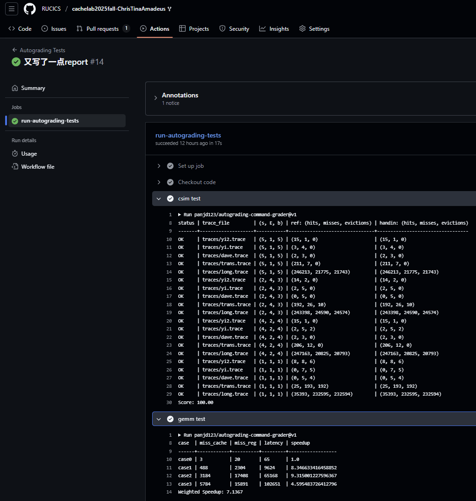
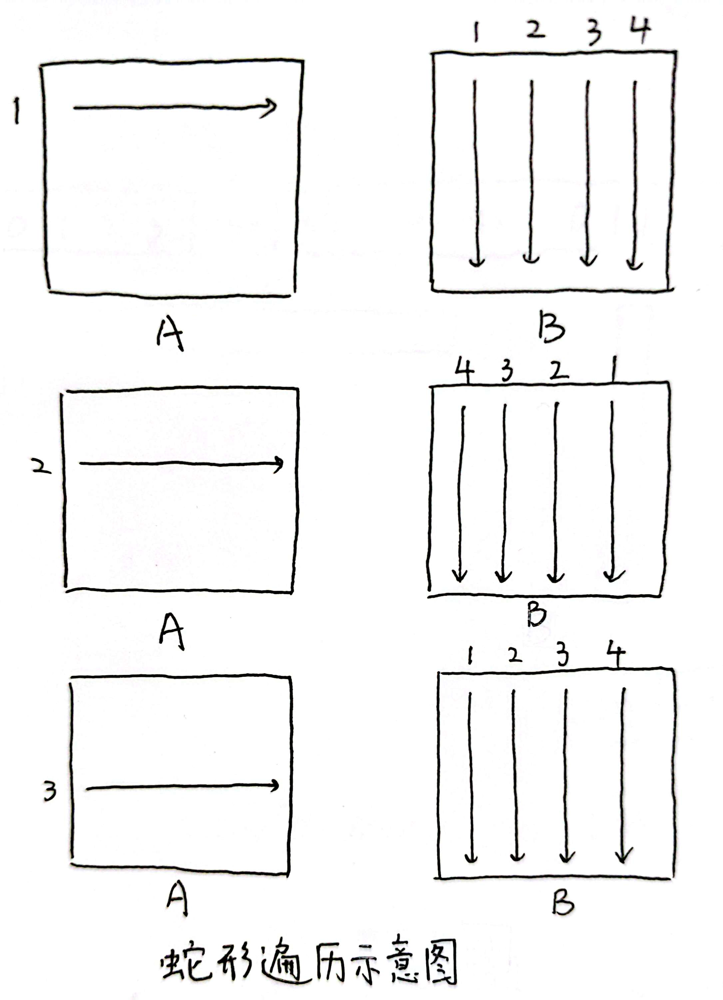
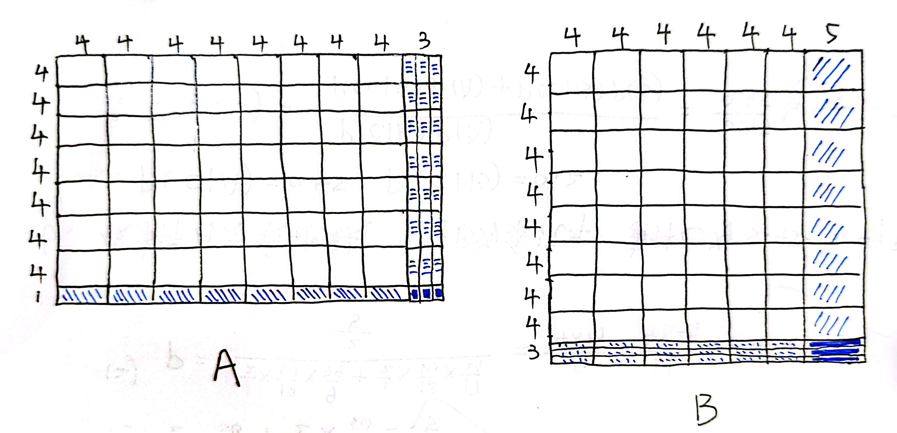

# CacheLab 报告

姓名：王松宸

学号：2024201594

| csim 分数 | case1 speedup | case2 speedup | case3 speedup | weighted speedup |
| --------- | ------------- | ------------- | ------------- | ---------------- |
| 100       | 8.3466          | 9.3150          | 4.5955      | 7.1367          |

<!-- 保留两位小数，四舍五入 -->

Autograder 截图：

<!-- 请同时将 Github Action 中的 csim test 和 gemm test 展开截图，并保证左上角出现你的仓库名，你可能需要调整浏览器缩放 -->

<!-- 如果 Github Action 不可用，本地的两个 test 的运行截图也可以-->

## Part A: cache 模拟器

### 实现简述

<!-- 简述 LRU 替换策略的 cache 的具体实现细节 -->
本节仅为简单实现对cache的模拟，L与S操作无差别，数据大小被假设为完全容纳在一行中，且不考虑寄存器，因此缓冲行(line)内仅保留地址作为输入即可。对地址的处理我选择忽略块偏移b，将组索引s转换为十进制int类型保存，将标记t转换为二进制形式并以字符串类型保存。cache的结构我选择用结构体进行模拟(数据规模较小，有比较明显的上限)，其中每一行包含t、有效位以及时间。每次进行读或写操作时，首先根据s定位到对应的组，然后遍历该组内的行，若找到t且有效位为1则命中，hits++，否则未命中。若未命中，则在该组内的有效位为0的行进行填充，misses++，若无则根据LRU策略选择最久未使用的行进行替换,evictions++。LRU的实现我放在亮点部分进行介绍。

### 亮点

<!-- 如果你有模拟性能上的优化，或者别的什么亮点可以用额外的篇幅具体讲讲，否则留空就可。 值得一提，这作为了第36次CSP考试的大模拟原题。 -->
每次访问用**全局递增的tick时间戳**给每一行的时间赋值，遍历行时记录每一组最小时间戳即可快速定位最近最少使用的行。相比于使用链表对时间进行结构上的模拟，这种方法节省了替换时的时间开销逻辑简介且效率高。

## Part B: 矩阵乘法优化

<!-- 下文请统一用 "行 * 列" 来表述矩阵形状 -->

<!-- 如果你想用 x, y 或者 i, j 变量来辅助你的表述，
请保证他们的对应关系是 x,y <=> i,j <=> 行,列，不然助教会晕，你们的分数也可能跟着晕，
我指你想说某个单独的矩阵中的 x 行 y 列的时候，不要说 y 行 x 列，
当然有三个矩阵的时候就没这回事了
 -->

### 亮点

<!-- 这相当于摘要，用最精简且可以被理解的关键词 + 简短的句子，分点描述你所有使用到的优化技巧，如果他们的重要性不同，请按顺序讲 -->

<!-- 比如：1. 分块：xxxx -->

<!-- 由于你还需要在后文详细说明，因此不必在此大费周章 -->

- **分块**：对于case1和case2，采用4×4分块；对于case3，主体部分采用4×4分块，尾部进行特殊分块，如1×16，4×5等。
- **寄存器分配**：有限的寄存器资源大部分用于存储累加器结果，A与B元素的加载占用寄存器数量极少，从而保证对C做到每轮循环一次性写回。
- **数据复用**：采用蛇形扫描路径改变了访存地址序列，提高了对cache中已加载数据的复用，降低miss_cache数量。
- **尾部处理**：在 case3 中，针对边缘设计了特定的尾部处理，用融合的方式减少了对内存的重复读写。

#### 未被采纳的想法
每一个case都剩余了几个寄存器未使用，其实可以用它们来存储部分元素来降低几个miss_cache，但我看了lab说明后觉得既然实际的寄存器数量远比lab里提供的要少，那这种优化就不太有实际意义了，因此没有采用。我更希望我代码里实现的优化都是对于实际的情况真正有用的。

#### 我认为的最优秀的实现排序

<!-- 请排序这三个 case，把你认为的最优秀的实现排在前面 -->

1.  case1
2.  case3
3.  case2

### case1

<!-- 1. 展示你的 cache miss 和 register miss -->

<!-- 2. 分析你的算法的理论 miss，如果和实际不完全相符，误差可能来自于哪里
（通常你的分析不用完全准确，不影响后续你展示算法，或者不同算法性能的大小关系即可） -->

<!-- 3. 你是怎么想到你的方法的，2 和 3 点可以调换顺序或者合并。或者说你的方法有哪些巧妙的设计。 -->

<!-- 4. 我们预计准确分析理论 miss，甚至是大致分析都可能是相当费力的，
此时我们更偏向你挑选一个你最想分享的 case 认真分析，其他 case 可以草率一点。
但这不代表我们只看一个 miss 分析，而是在你精力有限时请把最精华的写出来。
不要费了功夫写了三个分析但每个都浅尝辄止。
我们认为的排序是：
三个都精细分析 > 精细分析一个，潦草分析两个 > 只精细分析一个 > 潦草分析三个
 -->

<!-- 5. 分析 naive 算法的 cache miss 原因，视总篇幅也可以不讲 -->

<!-- 不要贴大段的代码，如果需要贴代码，请一小节一小节，并配合文字解释 -->

<!-- 你可以贴伪代码，或者用注释替代不重要的部分，尽量让报告精简 -->

<!-- 虽然我们分成了 3 节分别对应每个 case，但你不用每次都重复描述共通的思路，你可以修改报告的形式 -->

<!-- 原则上，简单的方法一个 case 所需描述的字数不应超过 500 字，复杂的不应超过 1000 字 -->

<!-- 如果你没有什么优化思路，这一节也可以就讲 baseline 算法的 cache miss 的分析 -->

<!-- 如果你的优化思路特别多，请先分点简述一下，如果超出了我们的字数限制，请把最重要的部分在规定字数内先解释清楚，再用”明显的分割线“隔开，再接着写次重要的优化 -->

<!-- 尽量给出你每个优化，或者是渐进的优化中每一步对性能的提升分别是多少 -->

<!-- 如果你有除了 gemm_test.py 脚本算出来的 cache miss 和 register miss 的其他数据展示，比如你跑了个参数的网格搜索，
请保证这些数据是可复现的，给出复现的代码，和复现代码的执行方法文档。这些应该包含在提交仓库中
-->

| miss_cache | miss_reg | latency | speedup |
| ---------- | -------- | ------- | ------- |
| 488        | 2304     | 9624    | 8.3466  |

##### 思考历程：
- **分块**：cache里每行能存放4个元素，因此最先想到的便是4×4的分块方式。对于16×16的矩阵来说，4×4也刚好能整除。与其他分块方式（如8×4、一级8×8二级4×4等）进行比较后，**4×4**的表现也最优秀。
- **寄存器分配**：最优化分块方式后我便思考如何最大化地利用寄存器的数量优势，使得计算时尽可能少地访问内存，从而降低miss_cache。根据我的试验，在保证A与B的元素正常加载的前提下，尽可能多的将剩余的寄存器分配给用于结果存储的累加器，最后**一次性写回C**，成果最显著。（这种分配策略在三个case中都进行了彻底的应用）
- **更进一步的优化**：speedup达到一个很可观的值后，需要从一些细节降低miss。比如对于B的列访问循环来说，我在一开始每次都是从左到右顺序访问的，这会引发一些额外的冲突miss。为此我采用了**蛇形扫描**的方式，改变了访问地址的顺序，又降低了8个miss_cache。(蛇形遍历也在三个case中都进行了应用)
  <!-- 插入一张蛇形遍历的解释图片 -->

  

##### 理论 miss 分析：

**(1)miss_cache**

- **总体**：4×4的分块使得每一轮B列的循环需要加载A的4行和B的4列，共占用32行cache（刚好占满）。此时一次性写回4×4的C块，需要替换其中的4行。每一轮循环都按照上面的模式进行直到计算完毕。因此如果进行较笼统的计算，**总的miss_cache大约为32×16+4×16=576次**。而实际上在不加入蛇形遍历时，miss_cache为496次。对于这减少的80次，我的理解是，由于cache的结构是直接映射的，地址中的组索引直接决定了它被映射到哪一行，也同时决定了哪一行会被替换掉。而A、B、C在内存上相邻排列，每个元素的组索引都由矩阵大小确定。比如A[0][0]地址为0x30000000，组索引为0，而B[0][0]地址为0x30000400，组索引也为0，它们在被读取时会加载到同一组，可能引起冲突。因此在新一轮B列的循环中，上一轮读取的一些数据可能并没有被替换掉（比如A的4行元素，在B列循环中它们每一轮都会被重新读取使用），反而能够被复用，最终降低了一些miss_cache。
- **蛇形遍历的影响**：在miss_cache为496次的基础上，加入蛇形遍历可以使miss_cache降低到488次。我的理解是，B列的循环结束后，cache中一定存有尾部4×4的B块，而下一轮A行循环也一定会读取这个B块。如果保持顺序读取的话，这个B块会被新读取的B块替换掉，导致B列循环进行到尾部时会产生至多4次miss_cache来重新加载这个B块。而**蛇形遍历使得这个B块在下一轮A行循环开始时被直接读取**，避免了重新加载。最终综合来看，蛇形遍历使得miss_cache降低了8次。

**(2)miss_reg**
miss_reg指的是对cache的读写次数，在每一个4×4块中，A与B均被读取16次，在n的循环中，总共是有4个这样的块，因此总和为4×(16+16)=128次。接着C被一次性写回4×4的块，共16次。这样一轮的B列循环中，miss_reg为144次。对于16×16的矩阵来说，一共需要进行16轮B列循环，因此**总的miss_reg为144×16=2304次**。这个值与实际测得的值完全一致。

### case3

| miss_cache | miss_reg | latency | speedup |
| ---------- | -------- | ------- | ------- |
| 5784       | 15891    | 102651  | 4.5955  |

##### 思考历程：

1.  **主体部分**：对于这种形状来说，无论哪种分块都需要进行特殊的尾部处理，并且由于A、B、C内存的连续性，即使按照4×4分块也只是会降低一些A的miss_cache，对B与C来说这样的分块并不会起到很好的优化作用。一开始我本想换一种分块方式，考虑到寄存器限制，选择了2×8的分块，总写回数目相同的基础上增加了n循环中一次遍历的元素个数，但效果并不如4×4，之后的1×16以及3×4等都不如4×4的效果好。因此我依然选择了**4×4分块+蛇形遍历**来处理主体部分。

2.  **尾部处理**：这是**case3的精华**所在。不进行特殊的尾部处理时miss_cache为6409次，处理后miss_cache降低至5784次。

    - **末列融合**：在处理B列循环时，我在遍历到B的第25列时额外将B的第29列也融合进来，形成一个4×5的特殊块。这需要额外的4个寄存器用来作为这个尾巴的累加器，但避免了一次完整独立的、效率低下的尾部遍历，减对A的重复加载。

    - **尾行合并处理**：对A剩余的最后一行，如果每次仍然处理4个B的元素，那么用于存储结果的寄存器使用量很少，因此我在遍历时将B列的多个块合并，增加了存储结果的寄存器使用量，最终第一次处理16列，第二次处理13列，对C的写回次数降低，从而减少了很多miss。

##### 理论 miss 分析：
**（1）miss_cache**：

1. 对于4×4的普通块，A与B在每一轮n循环中均加载4行4列，由于排列不规则，至少会产生8次miss，在n循环中加载8次，而这样的块共有56个，因此普通块产生的**miss_cache至少有8×8×56=3584次**，实际则会更多，因为不规则的形状会使得4列的读入增加很多miss_cache，比如B[1][1]与B[1][3]并不一定同时位于同一组中而能够被复用。
2. 对于末列融合的4×5块，有两种情况：
   a. A加载4行4列，B加载4行5列，至少会产生12次miss，在n循环中加载8次，所有循环中共有7次产生这种情况，因此**该块产生的miss_cache至少有12×8×7=672次**。
   b. A加载4行1列，B加载1行5列，至少会产生6次miss，在n循环中加载3次，所有循环中共有7次产生这种情况，因此**该块产生的miss_cache至少有6×3×7=126次**。
3. 对于B列正常加载的1×4块，A加载1行4列，B加载4行4列，至少会产生5次miss，在n循环中加载3次，所有循环中共有49次产生这种情况，因此**该块产生的miss_cache至少有5×3×49=735次**。
4. 对于尾行合并处理的1×16块，一种情况是A加载1行4列，B加载4行16列，至少会产生17次miss，在n循环中加载8次，因此该块产生的miss_cache至少有17×8=136次。另一种情况是A加载1行1列，B加载1行16列，至少会产生5次miss，在n循环中加载3次，因此该块产生的miss_cache至少有5×3=15次。综合来看，**该块产生的miss_cache至少有136+15=151次**。
5. 对于尾行合并处理的1×13块，A加载1行4列，B加载4行13列，至少会产生17次miss，在n循环中加载8次，因此该块产生的miss_cache至少有17×8=136次。另一种情况是A加载1行1列，B加载1行13列，至少会产生6次miss，在n循环中加载3次，因此该块产生的miss_cache至少有6×3=18次。综合来看，**该块产生的miss_cache至少有136+18=154次**。
6. 最后还需要考虑C的写回次数，共有4×4的块64个，1×16的块1个，1×13的块1个，4×1的块7个，因此**C的写回产生的miss_cache至少为64+4+4+7=79次**。

综合来看，**总的miss_cache至少为3584+672+126+735+151+154+79=5501次**，这与实际的5784次非常接近，少算的283次我认为来自于不规则形状导致的4列读入增加的miss_cache。

**（2）miss_reg**：
1. 对于A的前28行与B的前28列，B列循环内部，4×4的块中A与B均被读取16次，在n的循环中，总共有7个这样的块，因此总和为7×(16+16)=224次。4×1的块中A与B均被读取4次，在n的循环中，总共有3个这样的块，因此总和为3×(8+8)=48次。接着C被一次性写回4×4的块，共16次。这样一轮的B列循环中，miss_reg为224+48+16=288次。总共有49轮B列循环，因此**前28行的A与前28列B产生的miss_reg为288×49=14112次**。
2. 对于A的最后一行，1×16与1×13的B列分块对miss_reg并没有提升，依然是读取35次A的元素，35次B的元素，共70次，29列B使得总数为70×29=2030。接着C被写回1×16与1×13的块，共29次。因此**最后一行的A与B产生的miss_reg为2030+29=2059次**。
3. 对于B最后一列产生的4×1尾巴，A与B均被读取4次，在n的循环中，总共有7个这样的块，因此总和为7×(4+4)=112次。接着C被一次性写回4×1的块，共7次。因此**最后一列的B产生的miss_reg为112+4×7=140次**。

综合来看，**总的miss_reg为14112+2059+140=16311次**，这与实际的15891次非常接近，多出的420次我认为来自于我的计算误差，理论上miss_reg的计算值与实际值应当是相同的。
### case2

| miss_cache | miss_reg | latency | speedup |
| ---------- | -------- | ------- | ------- |
| 3184       | 17408    | 65168   | 9.3150  |

##### 思考历程：
观察A与B的形状，发现它们相比case1行列翻倍，因此只是增大了规模，并没有引入新的挑战。于是我基本沿用了case1的**4x4分块 + 蛇形遍历**的代码。

##### 理论 miss 分析：
这部分的分析过程与case1基本相同，因此只给出具体的计算，不作过多赘述。

**（1）miss_cache**：

- **总体**：每一轮B列循环产生8×8+4=68个miss_cache。共64轮B列循环，因此**总的miss_cache大约为68×64=4352次**。而实际上在不加入蛇形遍历时，miss_cache为3200次。对于这减少的1152次，我认为与case1中提到的原因完全一致，即A、B、C在内存上相邻排列，导致一些数据被复用，从而降低了一些miss_cache。
- **蛇形遍历的影响**：从3200次降低到3184次，其中的原因我认为与case1完全一致。

**（2）miss_reg**：
每个4×4块中，A与B均被读取16次，在n的循环中，总共有8个这样的块，因此总和为8×(16+16)=256次。接着C被一次性写回4×4的块，共16次。这样一轮的B列循环中，miss_reg为272次。对于32×32的矩阵来说，一共需要进行64轮B列循环，因此总的miss_reg为272×64=17408次。这个值与实际测得的值完全一致。

## 反馈/收获/感悟/总结

在这个lab中，我前前后后大约花费了超过30小时的时间，从读题审题，到写代码，再到调试优化，每一个部分都有着不小的工作量。过程是很痛苦的，但是当报告写出来以后又感觉非常有成就感，觉得自己确实学到了很多知识，尤其是在case3的调试中。不过我也在这个过程中找到了一些不合理的地方，比如由于cache的结构被设置为直接映射，LRU替换策略被彻底的忽视掉了，单纯只由元素地址决定它们被映射到哪个组。这对于miss_cache的计算来说，简直是增加了指数级的工作量，对于调试优化来说亦是如此。希望未来的lab中，cache的结构可以更加贴近实际一些，比如设置为组相联，虽然难度会进一步增大，但至少不会让我们在优化的过程中感觉十分的别扭。以及我真的很不喜欢这个lab设置打榜，感觉自己被逼着进行了好多好多的优化，十分痛苦...哎，真是又爱又恨！

<!-- 这一节，你可以简单描述你在这个 lab 上花费的时间/你认为的难度/你认为不合理的地方/你认为有趣的地方 -->

<!-- 或者是收获/感悟/总结 -->

<!-- 我们会认真听取大家的建议～ -->

## 参考的重要资料

无
<!-- 有哪些文章/论文/PPT/课本对你的实现有重要启发或者帮助，或者是你直接引用了某个方法 -->

<!-- 请附上文章标题或概述和可访问的网页路径 -->

<!-- 不列出参考了的参考资料会被认为是学术不端 -->
