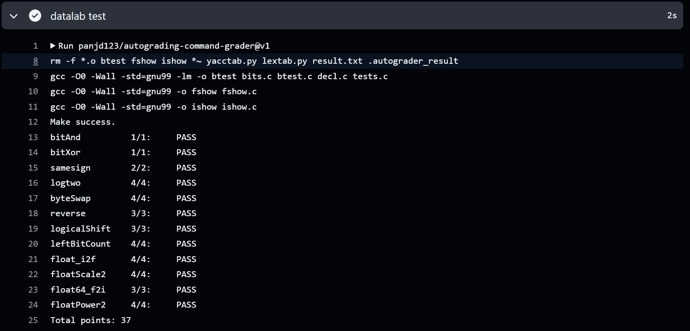

# datalab 报告

姓名：王松宸

学号：2024201594

| 总分  | bitAnd | bitXor | samesign | logtwo | byteSwap | reverse | logicalShift | leftBitCount | float_i2f | floatScale2 | float64_f2i | floatPower2 |
| -----| -- | ------ | -------- | ------ | -------- | ------- | ------------ | ------------ | --------- | ----------- | ----------- | ----------- |
| 37.00 | 1.00| 1.00   | 2.00     | 4.00   | 4.00     | 3.00    | 3.00         | 4.00         | 4.00      | 4.00        | 3.00        | 4.00        |


test 截图：
<p align="center">

</p>


<!-- TODO: 用一个通过的截图，本地图片，放到 imgs 文件夹下，不要用这个 github，pandoc 解析可能有问题 -->

## 代码及解题思路

### 亮点

<!-- 告诉助教哪些函数是你实现得最优秀的，比如你可以排序。不需要展开，展开请放到后文中。 -->

1. float_i2f
2. logicalShift
3. reverse

这三个函数分别包含了分类讨论、掩码构造和分组的思维，在这12个函数中比较有代表性。剩余的九个函数也基本使用了这些思维。

----

### float_i2f
```c
unsigned float_i2f(int x) {
    if (x == 0) {
        return 0;
    }
    int s = x < 0;
    unsigned us = s << 31;
    unsigned ax = x;
    if (s) {
        ax = (~ax) + 1;
    }

    int p = 0;
    unsigned y = ax;
    while (y >> 1) {
        y = y >> 1;
        p = p + 1;
    }
    unsigned exp  = ((p + 127) << 23);
    unsigned rem = ax - (1 << p);
    unsigned frac;
    if (p <= 23) {
        frac = rem << (23 - p);
    } 
    else {
        unsigned shift = p - 23;
        unsigned frac_base = rem >> shift; // 未舍入的尾数
        unsigned half = 1 << (shift - 1); // 判断与“半”的大小关系
        frac = (rem + (half - 1) + (frac_base & 1)) >> shift;
        if (frac >> 23) { // 处理溢出
            frac = 0; 
            exp = exp + 0x00800000; 
        }
    }
    return us | exp | frac;
}
```
首先处理符号位并取绝对值，然后通过循环确定最高有效位的位置 `p`，从而计算指数部分。接着根据 `p` 的值计算尾数部分，定义 `half`（正好为100..时根据`frac_base`末位来确定是否进位）实现最近偶数舍入，并处理尾数溢出的问题。

----

### logicalShift
```c
int logicalShift(int x, int n) {
    int u = 0x7FFFFFFF;
    u = ((u >> n) << 1) | 1;
    x = (x >> n) & u;
    return x;
}
```
构造掩码 `u`，使得高 `n` 位清零，其余 `32-n` 位为 1。最后将 `x` 右移 `n` 位并与掩码相与，得到逻辑右移的结果。

----

### reverse
```c
unsigned reverse(unsigned v) {
    v=(v >> 16) | (v << 16);
    v=((v & 0xFF00FF00) >> 8) | ((v & 0x00FF00FF) << 8);
    v=((v & 0xF0F0F0F0) >> 4) | ((v & 0x0F0F0F0F) << 4);
    v=((v & 0xCCCCCCCC) >> 2) | ((v & 0x33333333) << 2);
    v=((v & 0xAAAAAAAA) >> 1) | ((v & 0x55555555) << 1);
    return v;
}
```
通过分组交换的方式实现位反转。先交换高低16位，再交换每8位，再交换每4位，以此类推，直到交换每1位。设计掩码用于提取相应位置的位。

----

### bitXor

```c
int bitXor(int x, int y) {
    return (~(~x & ~y) & ~(x & y));
}
```
`~( x & y)` 用于将同为 1 的位变为 0，`~(~x & ~y)` 用于将不同的位变为 1。

----

### samesign

```c
int samesign(int x, int y) {
    if(x && y){
        x = x >> 31;
        y = y >> 31;
        return !(x ^ y);
    }
    else{
        if(x) return 0;
        if(y) return 0;
        return 1;
    }
}
```
对于非零的 `x` 和 `y`，右移 31 位后，所有位均变为符号位，异或后判断是否为 0 即可。若 `x` 与 `y` 中只有一个为 0，则直接返回 0；若 `x` 与 `y` 均为 0，则返回 1。

----

### logtwo
```c
int logtwo(int v) {
    int r = 0;
    int s;
    s = (v >> (r | 16)) > 0; r = r | (s << 4);
    s = (v >> (r | 8 )) > 0; r = r | (s << 3);
    s = (v >> (r | 4 )) > 0; r = r | (s << 2);
    s = (v >> (r | 2 )) > 0; r = r | (s << 1);
    s = (v >> (r | 1 )) > 0; r = r |  s;
    return r;
}
```
使用类似二分查找的思路确定 1 的位置，`s` 大于 0 意味着高位存在 1，进而更新 `r` 的值，否则 `r` 保持不变。最终用 `r` 的值作为结果。

----

### byteSwap
```c
int byteSwap(int x, int n, int m) {
    int move1 = (n << 3);
    int move2 = (m << 3);
    int byte1 = (x >> move1) & (0xFF);
    int byte2 = (x >> move2) & (0xFF);
    int xor = (byte1 ^ byte2);
    int change = ((xor << move1) | (xor << move2));
    return (x ^ change);
}
```
左移 3 位得到字节偏移量，提取出需要交换的两个字节。再由 `a^b^b=a` 的性质，得到字节交换后的结果。

----

### leftBitCount
```c
int leftBitCount(int x) {
    int y = ~x; 
    int n = 0;
    int s;
    s = !(y >> 16) << 4; n = n + s; y = y << s;
    s = !(y >> 24) << 3; n = n + s; y = y << s;
    s = !(y >> 28) << 2; n = n + s; y = y << s;
    s = !(y >> 30) << 1; n = n + s; y = y << s;
    s = !(y >> 31);      n = n + s;
    return n + !y;
}
```
将 `x` 取反后，可以利用右移产生的 0 判断左端队尾 1 的位置，接着使用类似二分查找的方法统计左端连续的 1 的个数。`!y` 用于边界情况（`x` 为 -1）处理。

----

### floatScale2
```c
unsigned floatScale2(unsigned uf) {
    unsigned exp = (uf << 1) >> 24 ;
    unsigned s = uf >> 31 ;
    unsigned frac = (uf << 9) >> 9 ;
    if(exp == 255) { // 特殊值
        return uf;
    }
    if(exp <=254){
        s = s << 31;
        if(exp == 0) { // 非规格化
            frac = frac << 1;
            return s | frac;
        }
        else { // 规格化
            exp = (exp + 1) << 23;
            if(exp == 255){
                return s | exp; // 无穷
            }
            else {
                return (s | exp) | frac;
            }
        }
    }
    return 0;
}
```
分类讨论规格化、非规格化、特殊值三种情况，分别进行处理。对于规格化数，指数 `+1`，溢出则结果为无穷；对于非规格化数，尾数直接左移 1 位；对于特殊值，直接返回原值。变量命名上，`exp`、`s`、`frac` 分别表示阶码、符号与尾数。

----

### float64_f2i
```c
int float64_f2i(unsigned uf1, unsigned uf2) {
    unsigned s = uf2 >> 31;
    int exp = (uf2 >> 20) & 0x7FF;              
    unsigned frac_high = uf2 & 0xFFFFF;         
    unsigned frac_low = uf1; 
    int E = exp + (-1023);                   
    if ((exp + 1) >> 11 | (E > 31)) {
        return 0x80000000; //上溢
    }
    if (!exp | (E < 0)) {
        return 0; // 下溢
    }
    unsigned M_hi = frac_high | (1 << 20); // 变为1.xxx
    unsigned M_lo = frac_low;
    int shift = 52 - E;  // [21,52]
    unsigned mag;
    if (shift >= 32) { // 获得整数部分
        mag = M_hi >> (shift - 32);
    } else {
        mag = (M_lo >> shift) | (M_hi << (32 - shift));
    }
    if (!s) { // 正数情况
        if (mag >> 31) {
            return 0x80000000;
        }
        return mag;
    }
    return (~mag) + 1; // 负数情况
}
```
首先提取符号位、指数和尾数部分，计算实际指数 `E`。根据 `E` 的值判断是否上溢或下溢。然后根据 `E` 的范围计算出整数部分的值，最后根据符号位返回相应的结果。

----

### floatPower2
```c
unsigned floatPower2(int x) {
    if(x > 127) { // 上溢
        return 0x7F800000;
    }
    if(x < -149) { // 下溢
        return 0;
    }
    if(x > -127) { // 规格化
        unsigned exp = x + 127;
        return exp << 23;
    }
    unsigned shift = -127 - x; // 非规格化
    return 1 << (22 - shift);
}
```
首先处理上溢和下溢的情况，然后根据 `x` 的范围分别计算规格化和非规格化数的表示。

## 反馈/收获/感悟/总结

<!-- 这一节，你可以简单描述你在这个 lab 上花费的时间/你认为的难度/你认为不合理的地方/你认为有趣的地方 -->

<!-- 或者是收获/感悟/总结 -->

<!-- 200 字以内，可以不写 -->
这个lab总共花费了我大约15个小时完成，难度我认为比cachelab要低挺多，只要掌握了位运算的基本知识就可以上手来做，但比较考察细节，有几个函数需要经过仔细的思考和设计。
## 参考的重要资料

<!-- 有哪些文章/论文/PPT/课本对你的实现有重要启发或者帮助，或者是你直接引用了某个方法 -->

<!-- 请附上文章标题和可访问的网页路径 -->
柴云鹏老师的PPT
