# 功能测试报告

本报告详细记录了对 HTML 解析器及 CSS/XPath 选择器功能的测试过程。测试采用由浅入深的策略，从基础的合成示例文件开始，逐步过渡到复杂网页结构。

## 1. 相关信息
- **操作系统**: Windows
- **编译器**: g++ (MinGW64)
- **测试数据**: 
    1. `example.html` (基础功能验证，包含各种结构)
    2. `lab3_news.html` (真实新闻导航页，文本内容丰富)
    3. `lab3_newslist.html` (真实新闻列表页，嵌套结构复杂)

---

## 2. example

该文件较为简单但内容丰富，包含了各种标签、ID、Class 的组合以及嵌套结构，适合测试很多基本的功能。

### 2.1 CSS 选择器测试

#### **E-C01** `.class1`
- **测试目的**: 验证基础类选择器。
- **预期结果**: 应选中 3 个元素：`div.class0.class1`, `span.class1`, `img.class1`。
- **测试结果**: 

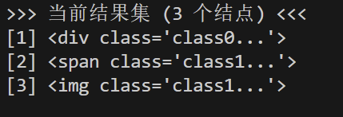

#### **E-C02** `div.class2.class3`
- **测试目的**: 验证多类选择器。
- **预期结果**: 应选中 1 个元素：`
`。
- **测试结果**: 

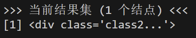

#### **E-C03** `.class4 .class5`
- **测试目的**: 验证后代选择器。
- **预期结果**: 应选中 2 个元素：内部的 `div.class5` 和 `p#id5.class5`。
- **测试结果**: 

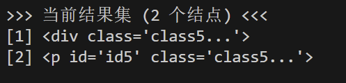

#### **E-C04** `div > .class1`
- **测试目的**: 验证子元素选择器。
- **预期结果**: 应选中 1 个元素：`span.class1`（它是某个 div 的直接子元素）。
- **测试结果**: 

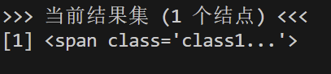

#### **E-C05** `.class1 + div`
- **测试目的**: 验证相邻兄弟选择器。
- **预期结果**: 应选中 2 个元素：紧跟在 `div.class0.class1` 后的 `div`，以及紧跟在 `img.class1` 后的 `div#id1`。
- **测试结果**: 

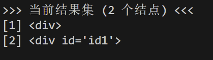

#### **E-C06** `div, span`
- **测试目的**: 验证分组选择器。
- **预期结果**: 应选中页面中所有的 `div` 和 `span` 元素，结果集应自动去重。
- **测试结果**: 

### 2.2 XPath 选择器测试

#### **E-X01** `/html/body/div`
- **测试目的**: 验证绝对路径。
- **预期结果**: 应选中 body 下的所有直接子 `div` 元素。
- **测试结果**: 

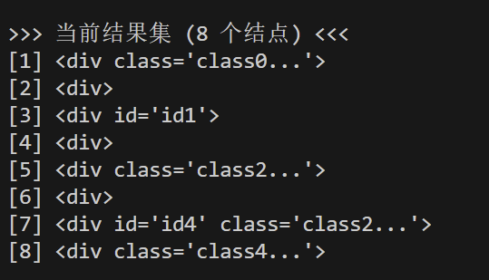

#### **E-X02** `//div[@class='class5']`
- **测试目的**: 验证属性谓语。
- **预期结果**: 应选中所有 class 属性为 "class5" 的 div。
- **测试结果**: 

#### **E-X03** `//div[@class='class4']//p`
- **测试目的**: 验证相对路径嵌套。
- **预期结果**: 应选中 class4 容器内部的所有 p 标签。
- **测试结果**: 

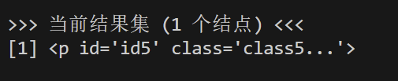

---

## 3. lab3_news

该页面是典型的导航页，包含大量的新闻标题和链接，适合测试文本提取和伪元素功能。

### 3.1 CSS 选择器测试

#### **N-C01** `h1, .read-count`
- **测试目的**: 验证分组提取。
- **预期结果**: 同时选中文章主标题（"人大毕业生..."）和阅读数（"73311"）。
- **测试结果**: 

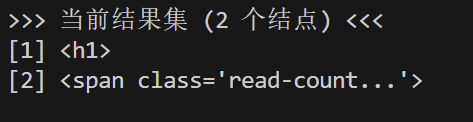

- **进阶验证** : 对该结果集执行 **InnerText**功能。
- **测试结果**: 输出与预期一致。

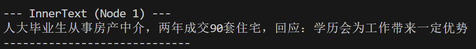

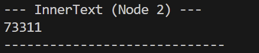

#### **N-C02** `header > h1`
- **测试目的**: 验证精准定位。
- **预期结果**: 仅选中 header 标签下的 h1，排除页面其他位置可能存在的 h1。
- **测试结果**: 

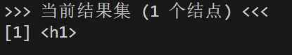

#### **N-C03** `h1 + p`
- **测试目的**: 验证相邻兄弟与空白节点处理。
- **预期结果**: 选中紧跟在 h1 后的 p 标签（包含来源和时间的元数据行）。
- **测试结果**: 

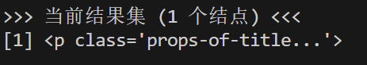

#### **N-C04** `h1::first-letter`
- **测试目的**: 验证伪元素-首字母。
- **预期结果**: 提取标题的第一个字符 "人"。
- **测试结果**: 

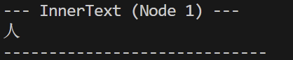

#### **N-C05** `h1::before("【今日头条】")`
- **测试目的**: 验证 DOM 修改。
- **预期结果**: 在标题前插入文本。查看 OuterHTML 应看到 `<h1...>【今日头条】人大毕业生...</h1>`。
- **测试结果**: 

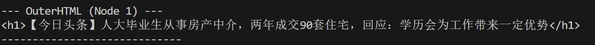

### 3.2 XPath 选择器测试

#### **N-X01** `//article/header/h1/text()`
- **测试目的**: 验证文本提取。
- **预期结果**: 直接获取 h1 标签内的纯文本内容,查看 InnerText 应看到 `人大毕业生...`。
- **测试结果**: 

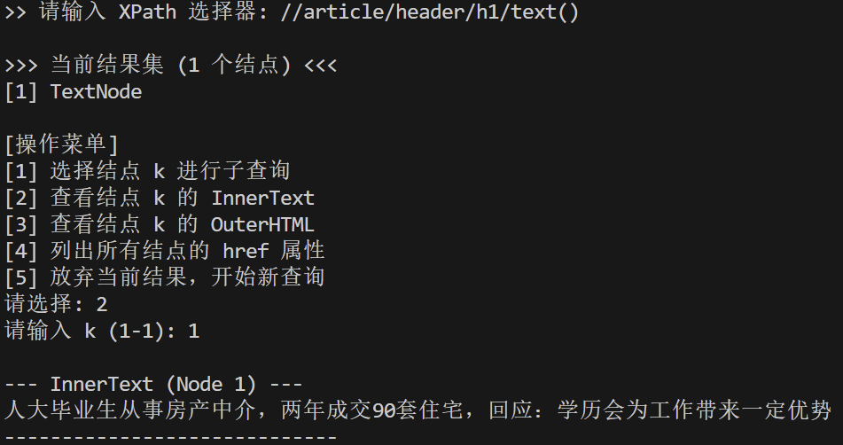

#### **N-X02** `//section[@class='article-content']//img`
- **测试目的**: 验证图片提取。
- **预期结果**: 选中正文区域内的所有图片元素，共 2 张。
- **测试结果**: 

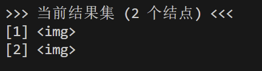

#### **N-X03** `//section[@class='comments']//p[@class='username']`
- **测试目的**: 验证深层嵌套。
- **预期结果**: 定位到评论区的用户名元素，内容包含 "古河镇幸福村第一书记陈鸿禹"。
- **测试结果**: 

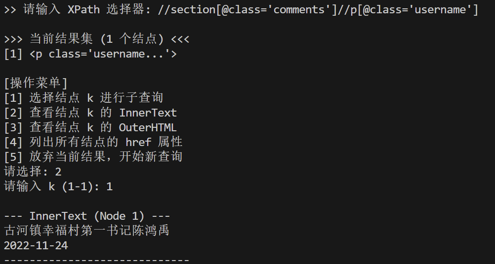

---

## 4. lab3_newslist

该页面包含复杂的嵌套列表、侧边栏结构以及众多A标签，适合测试列表项的批量提取、索引定位与结果再查询。

### 4.1 CSS 选择器测试

#### **L-C01** `div.content_col_2_list > ul > li > a`
- **测试目的**: 验证长路径组合。
- **预期结果**: 精准提取中间栏新闻列表的所有标题链接（应为 74 个）。首项应为 `党创办的第一所大学...`。
- **测试结果**: 

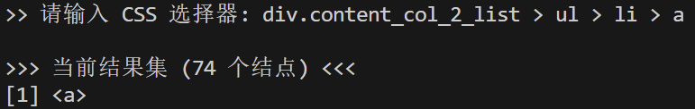

- **进阶验证**: 对该结果集首项执行 **InnerText**。
- **测试结果**: 与预期一致。

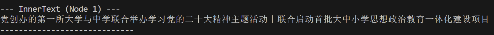

#### **L-C02** `div#weeknews ul.ca1_hot_item_t3 li a`
- **测试目的**: 验证 ID 与 Class 混用。
- **预期结果**: 提取侧边栏“一周热点”前三项的链接。
- **测试结果**: 

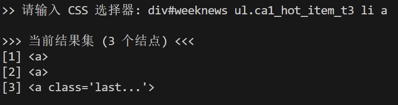

- **进阶验证**: 对该结果集执行 **InnerText**。
- **测试结果**: 显示出了热点前三项新闻的标题。

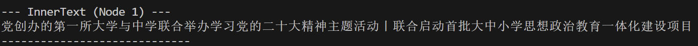

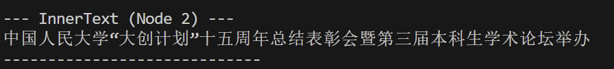

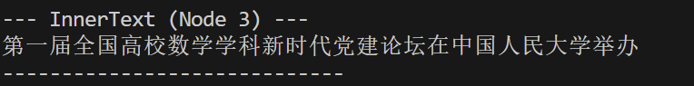

#### **L-C03** `.imp_news ~ div`
- **测试目的**: 验证通用兄弟选择器 (~)。
- **预期结果**: 选中顶部导航栏中 `.imp_news` 之后的所有同级 `div` 元素（共 5 个）。
- **测试结果**: 

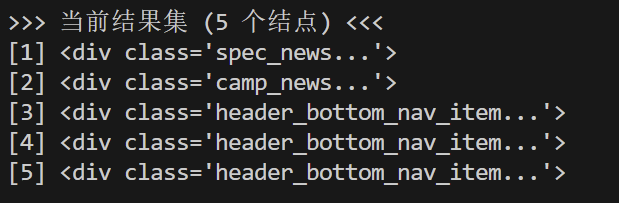

- **进阶验证**: 对该结果集首项执行 **在结果中继续查询**，输入 `a`，接着获取结果集中的所有 `href` 属性。
- **测试结果**: 

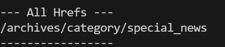

### 4.2 XPath 选择器测试

#### **L-X01** `//div[@class='content_col_2_list']/ul/li[1]/a`
- **测试目的**: 验证索引定位。
- **预期结果**: 仅选中新闻列表中的**第一条**新闻链接，A 标签包含的 href 应为 `<a href="https://news.ruc.edu.cn/archives/408586">`。
- **测试结果**: 

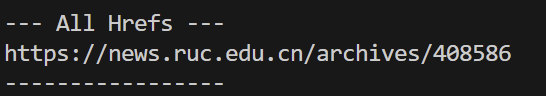

#### **L-X02** `//div[@id='weeknews']//a[@href='https://news.ruc.edu.cn/archives/408586']`
- **测试目的**: 验证属性值过滤。
- **预期结果**: 在“一周热点”区域查找特定链接，对该结果集执行 **InnerText** 应显示标题 `党创办的第一所大学...`。
- **测试结果**: 

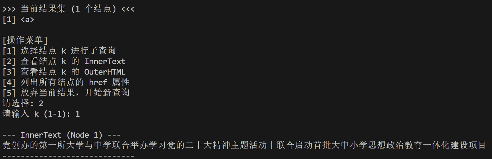

#### **L-X03** `//div[@class='archievelist']//li`
- **测试目的**: 验证批量列表项提取。
- **预期结果**: 选中“文章存档”区域的所有月份列表项（共 12 个）。
- **测试结果**: 

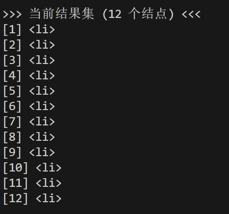
